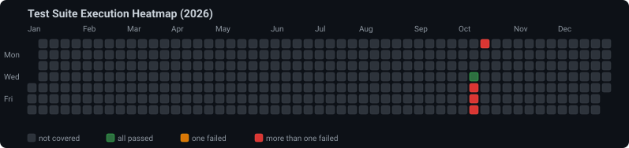
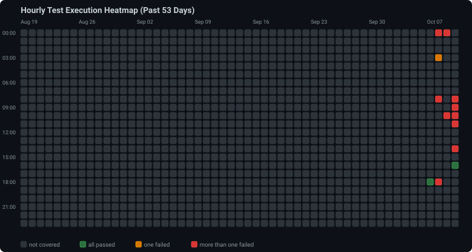

# googletrans-test

A comprehensive test suite and dashboard for validating the [`googletrans`](https://pypi.org/project/googletrans/) Python package (targeting version `4.0.2`).

## Overview

`googletrans` is a free and unlimited Python library that implements the Google Translate API. It uses Google Translate's AJAX API to make calls to detect and translate text.

This repository provides:
1. **Independent Test Suites:** Runs test cases using both `pytest` and Python's built-in `unittest` framework.
2. **Interactive HTML Test Dashboard:** Automatically runs both test suites and produces a styled, searchable `index.html` report with dark and light theme switching, collapsible test details, and clear status badges (e.g., `passed`, `failed`, `Error 429 - rate limit`).
3. **Hourly Automated Testing & Dual Heatmap Tracking:** Scheduled hourly execution (at minute :13 UTC) with persistent test results stored as an appending list in `data/history.json`, paired with both a full-year daily heatmap and a granular 24-hour execution matrix across the past 53 days.
4. **Automated GitHub Pages Deployment:** Continuous integration via GitHub Actions deploys the test dashboard to GitHub Pages on every push and hourly schedule.

## Daily Test Execution Heatmap

<picture>
  <source media="(prefers-color-scheme: dark)" srcset="data/heatmap_dark.svg">
  <source media="(prefers-color-scheme: light)" srcset="data/heatmap_light.svg">
  
</picture>

## Hourly Test Execution Heatmap (Past 53 Days)

<picture>
  <source media="(prefers-color-scheme: dark)" srcset="data/hourly_heatmap_dark.svg">
  <source media="(prefers-color-scheme: light)" srcset="data/hourly_heatmap_light.svg">
  
</picture>

---

## Background & Historical Fixes

### 1. `py-googletrans` vs `googletrans-curl` & `googletrans` 4.0.2
- **Historical Issue:** The original `googletrans` (v3.0.0) relied on legacy `requests` and a custom token generator (`tk`). Changes to Google's translation endpoint broke token generation, resulting in `HTTP 400 Bad Request` or `AttributeError: 'NoneType' object has no attribute 'group'`.
- **Alternative Implementations:** Community forks like `googletrans-curl` used `curl_cffi` to mimic browser TLS fingerprints.
- **Current Version (4.0.2):** `googletrans` v4.0.2 was updated to use `httpx` with asynchronous HTTP requests (`async/await`).

### 2. Async API Requirement in 4.0.2
Calling `translator.translate("hello")` synchronously in 4.0.2 returns a coroutine object rather than a `Translated` result object:
```python
# Incorrect (v3 legacy pattern):
result = translator.translate("hello", dest="es")
# AttributeError: 'coroutine' object has no attribute 'text'

# Correct (v4 async pattern):
result = await translator.translate("hello", dest="es")
# or asyncio.run(translator.translate("hello", dest="es"))
```

### 3. Rate Limits (HTTP 429) & IP Blocks
Because `googletrans` uses public Google Translate endpoints without an official API key, rapid or bulk requests may temporarily trigger HTTP 429 (Too Many Requests) or IP bans. Our test suite handles rate limit exceptions and tags them appropriately in the HTML test report.

---

## Installation & Setup

1. **Clone the repository:**
   ```bash
   git clone https://github.com/aikenf/googletrans-test.git
   cd googletrans-test
   ```

2. **Install dependencies:**
   ```bash
   pip install -r requirements.txt
   ```

---

## Running the Tests

### Option A: Run Pytest Suite
```bash
pytest
```

### Option B: Run Unittest Suite
```bash
python -m unittest discover -s tests -p "test_unittest_*.py"
```

### Option C: Generate Interactive HTML Report
To run both suites and generate the GitHub Pages report in `public/index.html`:
```bash
python generate_report.py
```
To quickly render `public/index.html` and `data/heatmap.svg` from existing `data/history.json` without executing tests:
```bash
python generate_report.py --skip-tests
```
Open `public/index.html` in your web browser to view the interactive test report with collapsible run details.

---

## Continuous Integration & GitHub Pages

Testing and deployment workflows are decoupled for performance:
1. **Push to `main` / `master` (`.github/workflows/deploy-pages.yml`):**
   - Triggers immediately on every push to update GitHub Pages.
   - Runs `python generate_report.py --skip-tests` to quickly build `public/index.html`, `data/heatmap.svg`, and `data/hourly_heatmap.svg` directly from the committed test history in `data/history.json`.
   - Deploys to GitHub Pages in seconds without running tests or encountering 429 timeouts.
2. **Scheduled & Manual Test Suite (`.github/workflows/run-tests.yml`):**
   - Triggers on hourly schedule (`:13 UTC` every hour) or manual `workflow_dispatch`.
   - Installs dependencies, runs both test suites via `python generate_report.py`, appends execution telemetry to `data/history.json`, updates `data/heatmap.svg` and `data/hourly_heatmap.svg`, commits the new history, and deploys the updated dashboard to GitHub Pages.

---

## Project Structure

```
googletrans-test/
├── .github/
│   └── workflows/
│       ├── deploy-pages.yml  # Fast GitHub Pages deploy workflow on push
│       └── run-tests.yml     # Scheduled hourly & manual test execution workflow
├── data/
│   ├── heatmap.svg           # Rendered SVG yearly daily activity heatmap (default)
│   ├── heatmap_dark.svg      # Rendered SVG yearly daily activity heatmap (dark theme)
│   ├── heatmap_light.svg     # Rendered SVG yearly daily activity heatmap (light theme)
│   ├── hourly_heatmap.svg    # Rendered SVG past 53 days 24-hour matrix (default)
│   ├── hourly_heatmap_dark.svg   # Rendered SVG past 53 days 24-hour matrix (dark theme)
│   ├── hourly_heatmap_light.svg  # Rendered SVG past 53 days 24-hour matrix (light theme)
│   └── history.json          # Appending execution records history
├── public/
│   └── index.html            # Generated test dashboard for GitHub Pages
├── tests/
│   ├── test_pytest_suite.py  # Pytest test cases
│   └── test_unittest_suite.py# Unittest test cases
├── generate_heatmap.py       # SVG calendar heatmap generator
├── generate_report.py        # Custom HTML report generator (--skip-tests supported)
├── AGENTS.md                 # Guidelines for agentic development
├── CHANGELOG.md              # Project version history & release notes
├── pyproject.toml            # Project configuration
├── pytest.ini                # Pytest configuration
├── requirements.txt          # Requirements file
└── README.md                 # Project documentation
```
